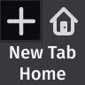

# New Tab Home

Set your Firefox new tab page to match what is configured as your homepage.

## Permissions

- Browser Settings
  - To determine what you have set as your homepage
- Browser Storage
  - To store your cursor location preference when opening a new tab

## Changelog
- 1.3
  - Refactor extension
  - Provide more feedback when homepages set to use priveleged URLs and cannot be used
  - Add information regarding requested permissions and why they're used to readme
  - Remove the browserHistory and browserTabs permission
- 1.2
  - Added icon
- 1.1
  - Add preference for cursor focus when new tab has loaded
    - Options are `Website` or `Address Bar`
- 1.0
  - Initial release

## Acknowledgements
This extension would not have been possible without:
* Mozilla for [Firefox](https://www.mozilla.org/firefox/), [Fira Sans](https://mozilla.github.io/Fira/), [Firefox Design resources](https://design.firefox.com/photon/), and their [excellent WebExtension documentation](https://developer.mozilla.org/en-US/docs/Mozilla/Add-ons/WebExtensions)
<<<<<<< HEAD
  * Firefox is the only major cross-platform browser that does not contribute to the Webkit/Blink hegemony
  * Firefox is fast, reliable, open-source, and respects my privacy.
=======
  * Firefox is the only major cross-platform browser that does not run on WebKit/Blink
  * Firefox is the only major cross-platform browser that I don't feel horrible about using
>>>>>>> e5ea4e8cb66f70a3d0f371ec797b4ae6f77b9a4e
* [Visual Studio Code](https://code.visualstudio.com/) for writing code
* [Figma](https://www.figma.com/) for icon design
* [New Tab Override](https://addons.mozilla.org/en-US/firefox/addon/new-tab-override/) for inspiration
* [Rasmus Andersson](https://tiwtter.com/rsms) for the beautiful [Inter](https://rsms.me/inter/) font
